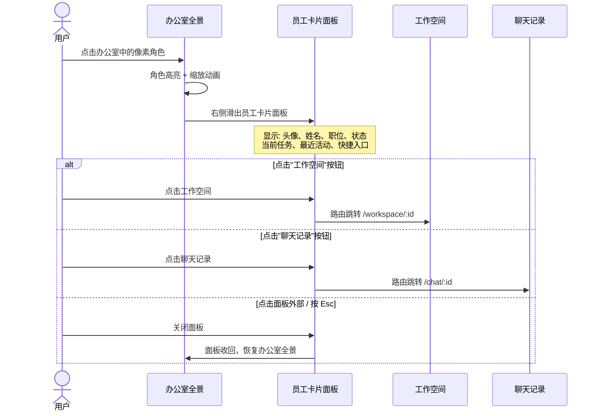
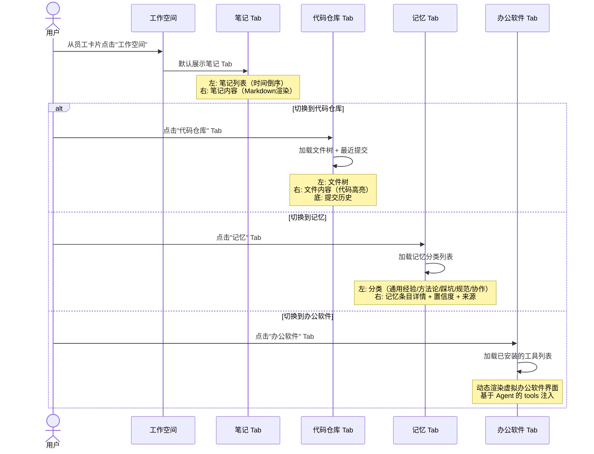
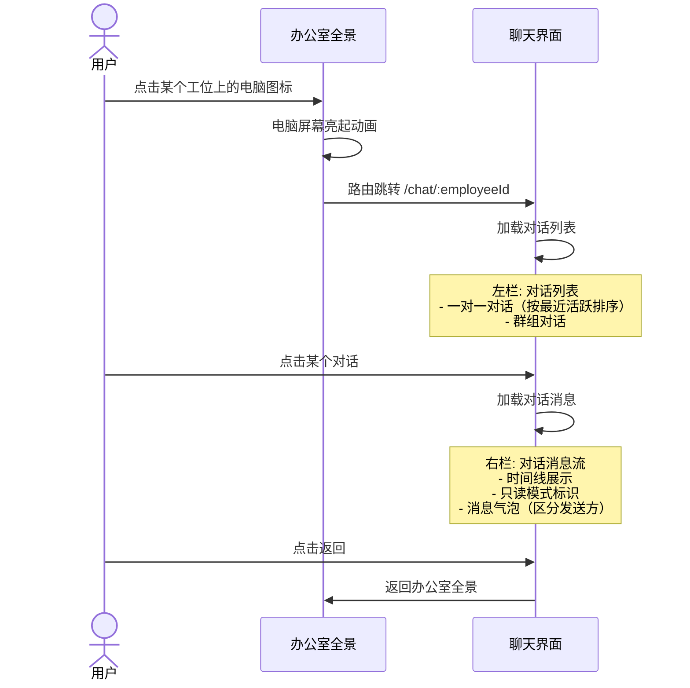
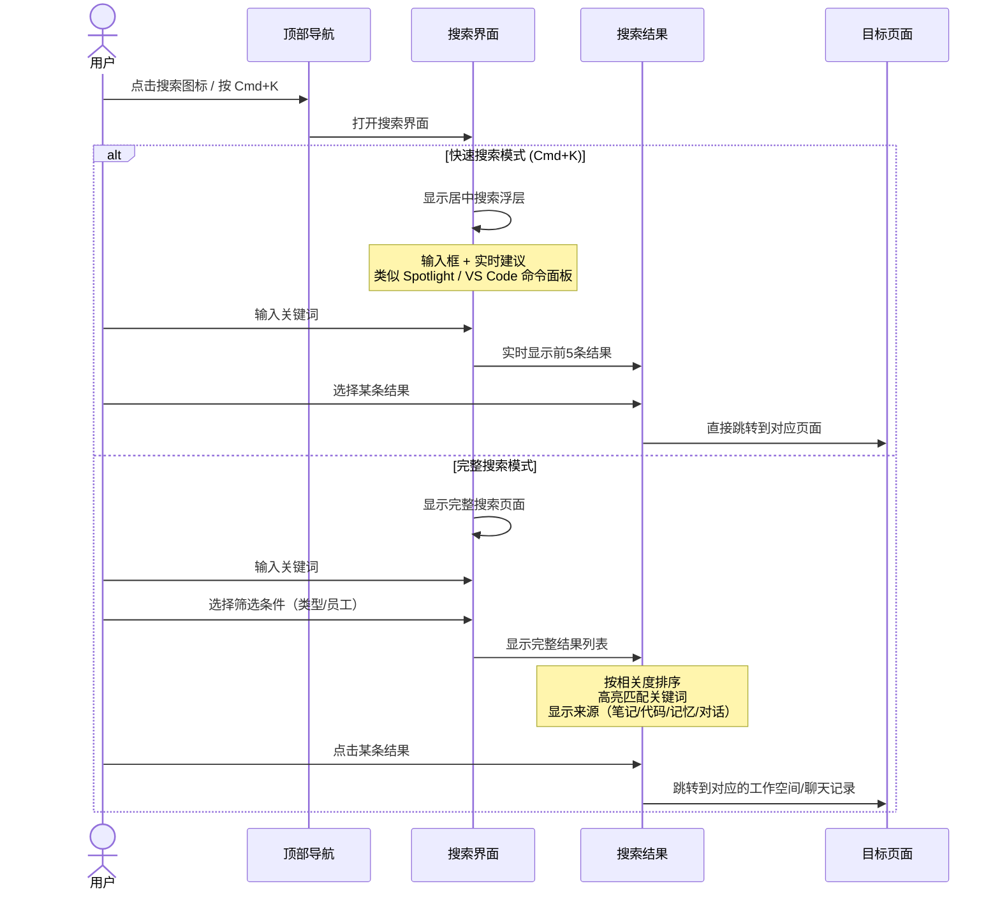
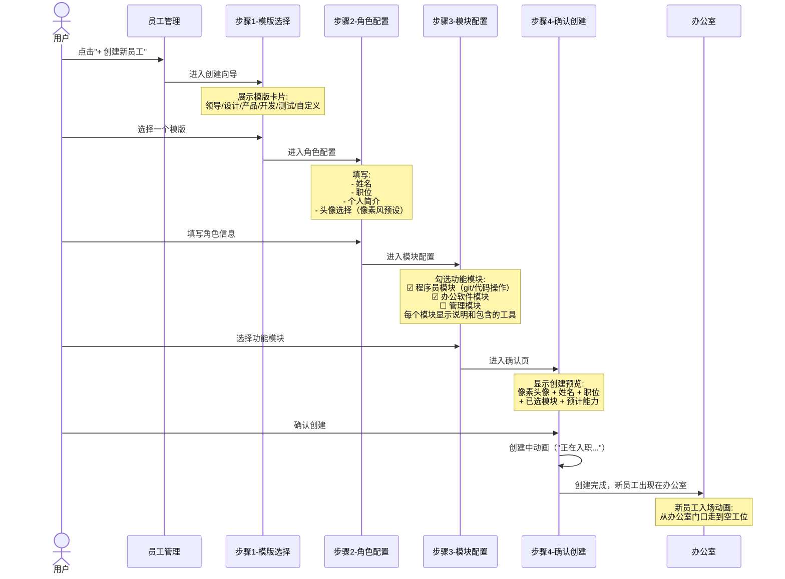
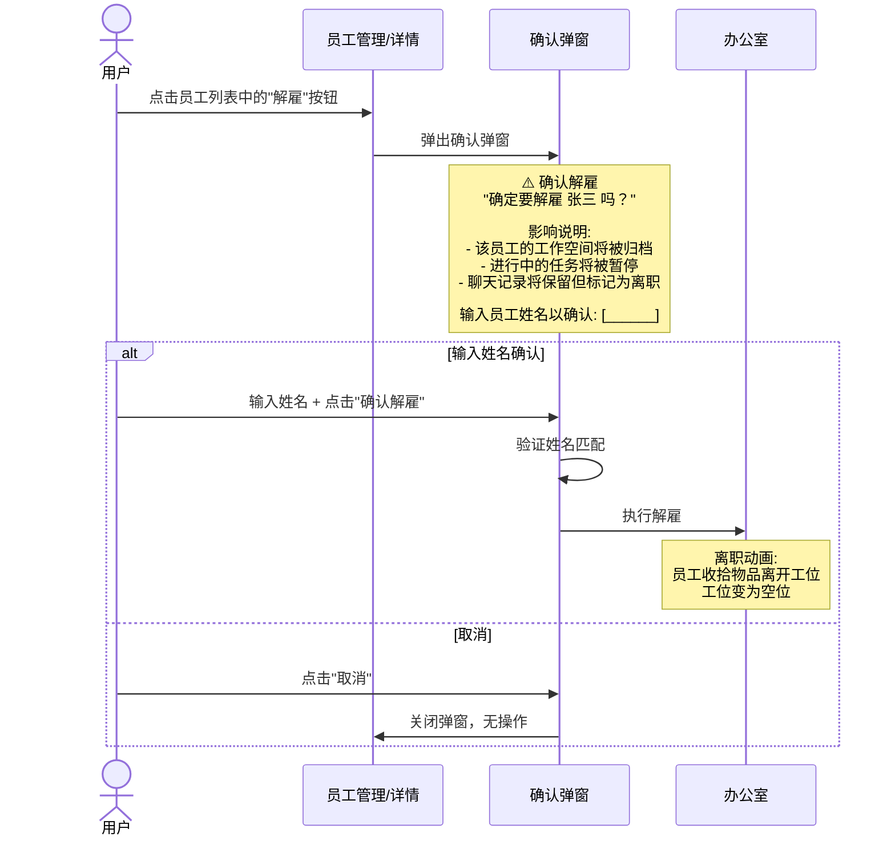

# Supercell - 核心交互流程

## 1. 点击员工 → 查看详情

**细节：**
- 点击角色时，该角色执行一个"注意"动画（转身面向镜头/挥手）
- 面板滑出使用 300ms ease-out 动画
- 面板宽度：桌面端 400px，移动端全屏
- 背景使用半透明遮罩（rgba(0,0,0,0.3)）

---

## 2. 进入工作空间 → 查看各项内容

**细节：**
- Tab 切换无页面刷新，使用客户端路由 hash（`/workspace/:id#notes`）
- 笔记内容支持 Markdown 渲染
- 代码仓库使用简化的文件浏览器（非完整 IDE）
- 记忆条目按置信度和引用次数排序

---

## 3. 点击电脑 → 查看聊天记录

**细节：**
- 聊天界面为只读模式，用户不能参与员工对话
- 底部显示"只读模式"提示
- 对话列表显示未读消息数量
- 支持按时间范围筛选对话
- 电脑图标可点击热区最小 32x32px（等距视角下电脑较小，需保证可交互性）

---

## 4. 搜索功能流程

**细节：**
- `Cmd+K`（Mac）/ `Ctrl+K`（Windows）触发快速搜索
- 快速搜索浮层尺寸：宽度 500px，最大高度 400px，居中显示，背景遮罩
- 搜索范围：笔记标题和内容、代码文件名和内容、记忆条目、对话内容
- 搜索结果按相关度排序，关键词高亮
- 支持筛选：按类型（笔记/代码/记忆/对话）、按员工
- 搜索防抖：300ms

---

## 5. 创建新员工流程

**细节：**
- 4步向导，有步骤指示器和进度条
- 每步都可以返回上一步修改
- 模版选择后自动填充默认值，用户可修改
- 确认创建后有"入职动画"（像素角色从门口走到工位）
- 创建时初始化3个 Agent 实例（干活、整理记忆、聊天）

---

## 6. 解雇员工流程

**细节：**
- 解雇是高危操作，需要二次确认（输入姓名）
- 解雇后数据不删除，标记为"已离职"（可在管理页查看历史员工）
- 办公室中该工位变为空位，可供新员工使用
- 离职动画：角色从工位走向门口并消失
