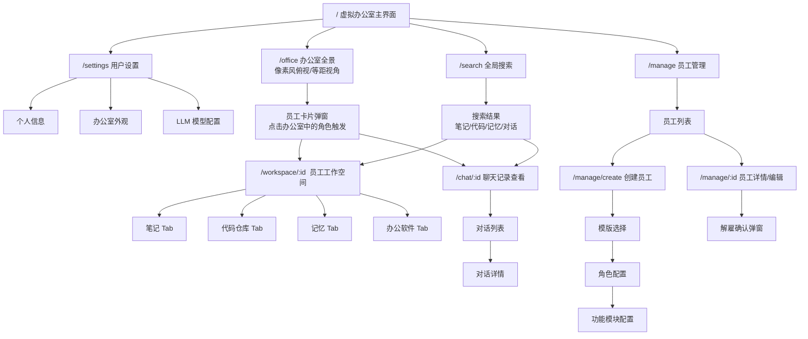

# Supercell - 页面结构 / 站点地图

## 页面层级总览

## 页面说明

| 页面 | 路径 | 说明 |
|------|------|------|
| 办公室全景 | `/office` | 默认首页，像素风等距视角的办公室场景，展示所有员工在工位上的实时状态 |
| 员工卡片 | 弹窗/抽屉 | 点击办公室中某个角色后弹出，显示基本信息+快捷入口 |
| 员工工作空间 | `/workspace/:id` | 员工的个人空间，包含笔记、代码仓库、记忆、办公软件四个 Tab |
| 聊天记录 | `/chat/:id` | 点击员工电脑后进入，查看该员工与其他员工的所有对话 |
| 员工管理 | `/manage` | 员工列表 + 创建/解雇入口 |
| 创建员工 | `/manage/create` | 选择模版 → 配置角色 → 配置功能模块 → 确认创建 |
| 全局搜索 | `/search` | 搜索员工工作空间中的笔记、代码仓库、记忆、对话记录 |
| 用户设置 | `/settings` | 个人信息、办公室外观偏好、LLM 模型配置（MVP 阶段基础功能） |

## 导航结构

- **顶部导航栏**：办公室全景 | 员工管理 | 全局搜索 | 用户设置
- **办公室内导航**：通过点击场景中的元素（员工角色、电脑、工位）进入对应页面
- **面包屑**：办公室 > 员工名 > 工作空间/聊天记录 > 具体 Tab
- **返回**：所有子页面都可返回办公室全景
