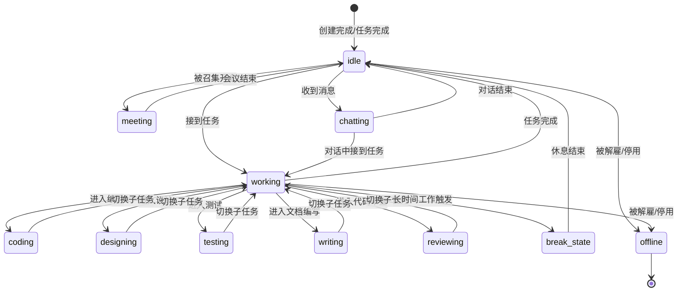

# Supercell - 员工状态机定义

## 状态总览



## 状态定义

| 状态 | 英文标识 | 说明 | 时长限制 |
|------|---------|------|---------|
| 空闲 | `idle` | 无任务，待命状态 | 无限 |
| 工作中 | `working` | 正在处理任务（父状态/逻辑状态，无独立视觉动画，会立即进入子状态） | 无限 |
| 编码中 | `coding` | 正在编写/修改代码 | 工作中的子状态 |
| 设计中 | `designing` | 正在做 UX/UI 设计 | 工作中的子状态 |
| 测试中 | `testing` | 正在执行测试 | 工作中的子状态 |
| 编写中 | `writing` | 正在编写文档/需求/笔记 | 工作中的子状态 |
| 审查中 | `reviewing` | 正在做 Code Review | 工作中的子状态 |
| 开会 | `meeting` | 正在参与多人讨论 | 最长 30min |
| 聊天中 | `chatting` | 正在与其他员工一对一沟通 | 最长 10min |
| 休息 | `break` | 休息状态（自动触发或手动） | 5-15min |
| 整理记忆 | `memorizing` | 正在整理和更新个人记忆库 | 自动，后台 |
| 离线 | `offline` | 已停用或已解雇 | 永久 |

## 视觉表现

### 像素角色动画

| 状态 | 角色动画 | 头顶气泡 | 工位效果 |
|------|---------|---------|---------|
| `idle` | 坐在椅子上，偶尔左右张望 | 💭 (空的思考泡泡) | 电脑屏幕显示桌面 |
| `coding` | 快速打字动画，偶尔停顿思考 | ⌨️ "编码中" | 电脑屏幕显示代码（绿色字符流） |
| `designing` | 手持画笔/触控笔，在屏幕上比划 | 🎨 "设计中" | 电脑屏幕显示彩色图形 |
| `testing` | 打字 + 偶尔点头/摇头 | 🧪 "测试中" | 电脑屏幕显示绿色✓/红色✗ |
| `writing` | 缓慢打字，偶尔停下来思考 | 📝 "编写中" | 电脑屏幕显示文档 |
| `reviewing` | 盯屏幕看，偶尔皱眉/点头 | 🔍 "审查中" | 电脑屏幕显示代码 + 批注 |
| `meeting` | 离开工位，出现在会议区域 | 🗣️ "开会" | 工位空着 |
| `chatting` | 打字动画（较慢，像发消息） | 💬 "聊天中" | 电脑屏幕显示聊天界面 |
| `break` | 伸懒腰/喝咖啡/站起来走动 | ☕ "休息" | 电脑屏幕变暗 |
| `memorizing` | 坐着，头顶出现闪烁光效 | 🧠 "整理中" | 电脑屏幕显示笔记 |
| `offline` | 工位空着，椅子推进桌子下 | 无 | 电脑关机 |

### 状态颜色编码

用于列表视图和状态指示灯：

| 颜色 | 含义 | 状态 |
|------|------|------|
| 🟢 绿色 | 活跃工作中 | `coding`, `designing`, `testing`, `writing`, `reviewing` |
| 🔵 蓝色 | 沟通中 | `meeting`, `chatting` |
| 🟡 黄色 | 空闲/待命 | `idle` |
| 🟠 橙色 | 休息/后台 | `break`, `memorizing` |
| 🔴 红色/灰色 | 离线 | `offline` |

### 状态转换动画

| 转换 | 动画描述 | 时长 |
|------|---------|------|
| `idle` → `coding` | 角色伸手摸键盘，屏幕亮起代码 | 500ms |
| `idle` → `meeting` | 角色站起，走向会议区 | 1000ms |
| `coding` → `break` | 角色推开键盘，伸懒腰 | 600ms |
| `break` → `idle` | 角色重新坐好，看向屏幕 | 400ms |
| 任意 → `offline` | 角色站起，收拾物品，走向门口 | 2000ms |
| `[*]` → `idle`（新员工入职） | 角色从门口走到工位坐下 | 1500ms |

## 状态转换规则

### 自动转换
- 连续工作 > 2小时 → 自动进入 `break`（5-15分钟）
- 收到消息且当前 `idle` → 自动进入 `chatting`
- 被分配任务且当前 `idle` → 自动进入 `working`
- `memorizing` 在任何工作状态下可并行（后台 Agent 实例处理）

### 优先级
```
offline > meeting > working(子状态) > chatting > memorizing > break > idle
```
- 高优先级状态可以打断低优先级状态
- `meeting` 可以打断除 `offline` 外的所有状态
- `chatting` 不打断 `working` 子状态，排队等工作完成

### 三个 Agent 实例与状态映射

每个员工由最多 3 个 Agent 实例维护，状态映射如下：

| Agent 实例 | 负责状态 | 说明 |
|-----------|---------|------|
| 主工作实例 | `coding`, `designing`, `testing`, `writing`, `reviewing`, `meeting` | 执行核心任务 |
| 记忆整理实例 | `memorizing` | 后台整理经验和记忆，不影响主工作 |
| 聊天实例 | `chatting` | 与其他员工沟通，可并行于工作 |

这意味着一个员工可以同时处于 `coding`（主实例）+ `memorizing`（记忆实例）+ `chatting`（聊天实例），办公室视觉上显示优先级最高的状态。
